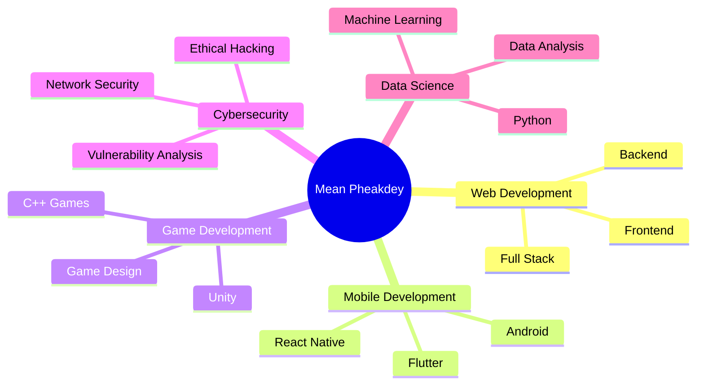

<!-- Profile Header -->
<h1 align="center">
  
</h1>

<p align="center">
  <samp>
    💻 Software Developer | 🎮 Game Enthusiast | 🚀 Technology Explorer
  </samp>
</p>

<!-- Social Links -->
<p align="center">
  <a href="mailto:connect.meanphekadey069@gmail.com"></a>
  <a href="https://twitter.com/itskdey"></a>
  <a href="https://www.linkedin.com/in/yourprofile"></a>
  <a href="https://www.instagram.com/itskdey/"></a>
  <a href="https://www.facebook.com/itskdey/"></a>
  <a href="https://www.youtube.com/channel/UCcLED5up-1-RgYkOYdc_ZUw"></a>
</p>

<p align="center">
  
</p>

---

## 👨‍💻 About Me

```javascript
const meanPheakdey = {
    location: "Phnom Penh, Cambodia",
    education: "Computer Science Student",
    currentFocus: ["Mobile Development", "Web Development", "Game Development"],
    workingOn: ["ANT QUIZ", "SAHAKUMN+"],
    learning: ["Flutter", "React Native", "Cloud Architecture"],
    hobbies: ["Gaming", "Open Source", "Problem Solving"],
    askMeAbout: ["Web Dev", "Mobile Dev", "C++", "Python", "Game Design"],
    funFact: "Software developer by day, code ninja by night! 🥷"
};
```

---

## 🚀 Current Projects

### 📱 Active Development

<table>
  <tr>
    <td width="50%">
      <h3 align="center">ANT QUIZ</h3>
      <p align="center">
        <a href="https://meanpheakdey.epizy.com/projects/ant-quiz/download/">
          
        </a>
      </p>
      <p align="center">
        An interactive quiz application designed for educational purposes with gamification elements.
      </p>
      <p align="center">
        
        
      </p>
    </td>
    <td width="50%">
      <h3 align="center">SAHAKUMN+</h3>
      <p align="center">
        <a href="https://meanpheakdey.epizy.com/projects/sahakumn/download/">
          
        </a>
      </p>
      <p align="center">
        A comprehensive collaboration platform aimed at enhancing productivity and teamwork.
      </p>
      <p align="center">
        
        
      </p>
    </td>
  </tr>
</table>

---

## 💼 Professional Experience

### Contributed Projects

<details>
<summary><b>🤝 Open Source Contributions</b></summary>
<br>

> *Add your contributed projects here*

- **Project Name** - Brief description of your contribution
  - Technologies: `Technology Stack`
  - Role: Your specific contributions
  - [Repository Link](#)

</details>

### Academic Projects

<details>
<summary><b>🎓 University & School Projects</b></summary>
<br>

#### C++ Movie Management System
- Comprehensive movie database management system built with C++
- Features: CRUD operations, search functionality, user authentication
- **Tech Stack:** C++, File I/O, OOP principles

#### Personal Portfolio Website
- Professional portfolio showcasing projects and skills
- **Live Demo:** [meanpheakdey.epizy.com](http://www.meanpheakdey.epizy.com/)
- **Tech Stack:** HTML, CSS, JavaScript, PHP

</details>

### Personal Projects

<details>
<summary><b>🛠️ Side Projects & Experiments</b></summary>
<br>

#### Heartbleed Security Analysis
- Research project analyzing the Heartbleed vulnerability
- Status: 🔄 In Progress
- **Focus:** Cybersecurity, Cryptography, Network Security

#### Additional Projects
- Add your personal projects here
- Include brief descriptions and technologies used

</details>

---

## 🛠️ Technical Skills

### Languages

<p>
  
  
  
  
  
  
  
  
</p>

### Frameworks & Libraries

<p>
  
  
  
  
  
  
  
</p>

### Tools & Technologies

<p>
  
  
  
  
  
  
</p>

### Databases

<p>
  
  
  
  
</p>

---

## 📊 GitHub Statistics

<p align="center">
  
  
</p>

<p align="center">
  
  
</p>

<p align="center">
  
</p>

> **Note:** Top languages is a metric of the languages in my public code and doesn't reflect experience or skill level.

---

## 🎯 Areas of Interest



---

## 🏆 Achievements & Certifications

<details>
<summary><b>📜 View Certifications & Achievements</b></summary>
<br>

> *Add your certifications and achievements here*

- **Certification Name** - Issuing Organization (Year)
- **Achievement Title** - Description
- **Competition/Award** - Details

</details>

---

## 📝 Latest Blog Posts

<!-- BLOG-POST-LIST:START -->
> *Coming Soon! Will be sharing technical articles and tutorials.*
<!-- BLOG-POST-LIST:END -->

---

## 🤝 Let's Connect!

<p align="center">
  <i>I'm always interested in collaborating on interesting projects, discussing technology, or just having a chat!</i>
</p>

<p align="center">
  <a href="mailto:connect.meanphekadey069@gmail.com">
    
  </a>
  <a href="https://meanpheakdey.epizy.com">
    
  </a>
</p>

---

<p align="center">
  
</p>

<p align="center">
  <i>⭐️ From <a href="https://github.com/itskdey">itskdey</a> - Feel free to star my repositories if you find them interesting!</i>
</p>