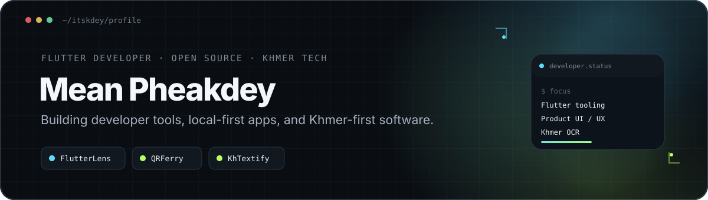

<div align="center">



<br />

[](https://github.com/itskdey)
[](https://www.linkedin.com/in/mean-pheakdey-6849a4287/)
[](mailto:meanpheakdey069@gmail.com)
[](https://twitter.com/itskdey)

</div>

## `> whoami`

I'm a Flutter developer focused on **developer tooling**, **local-first mobile products**, and **Khmer-first software**.

I like projects with a clear technical idea behind them — things that are useful, visually considered, and interesting enough to learn from in public.

```text
CURRENT MODE
────────────
tooling      Flutter · DevTools · VM Service
product      mobile UX · motion · local-first
language     Khmer OCR · text technology
shipping     open source · packages · experiments
```

---

## `> building --now`

<table>
<tr>
<td width="50%" valign="top">

### 🔍 [FlutterLens](https://github.com/itskdey/flutterlens)

**A modern visual inspector for Flutter.**

A DevTools extension built around the real Flutter Inspector and VM Service, with a live widget tree, selection sync, properties, layout information, and source locations.

`DevTools` `Inspector` `VM Service` `Flutter`

**→ [Explore FlutterLens](https://github.com/itskdey/flutterlens)**

</td>
<td width="50%" valign="top">

### ◫ [QRFerry](https://github.com/itskdey/qr_ferry_flutter)

**Offline file transfer through animated QR codes.**

The sender's display and receiver's camera become the transport channel — no Wi-Fi, Bluetooth, account, cloud storage, or backend required.

`Flutter` `QR byte mode` `CRC32` `Local-first`

**→ [Explore QRFerry](https://github.com/itskdey/qr_ferry_flutter)**

</td>
</tr>
<tr>
<td width="50%" valign="top">

### ក [KhTextify](https://khtextify.app)

**Khmer-first OCR and text tools for mobile.**

A project focused on extracting, organizing, transforming, and working with Khmer text using OCR and practical language utilities.

`Flutter` `OCR` `Tesseract` `Supabase` `Khmer`

**→ [Visit KhTextify](https://khtextify.app)**

</td>
<td width="50%" valign="top">

### ⌄ [full_width_dropdown_button](https://github.com/itskdey/full_width_dropdown_button)

**A polished reusable dropdown package for Flutter.**

Nested submenus, smart overlay positioning, hover feedback, rich leading widgets, and smooth interaction animations.

`Flutter Package` `UI` `Overlay` `Animation`

**→ [View package source](https://github.com/itskdey/full_width_dropdown_button)**

</td>
</tr>
</table>

---

## `> selected --open-source`

| Project | Signal |
| --- | --- |
| **[FlutterLens](https://github.com/itskdey/flutterlens)** | Flutter runtime inspection with real DevTools + Inspector APIs |
| **[QRFerry](https://github.com/itskdey/qr_ferry_flutter)** | Air-gapped optical file transfer using animated QR frames |
| **[full_width_dropdown_button](https://github.com/itskdey/full_width_dropdown_button)** | Reusable interaction-heavy Flutter UI package |
| **[tesseract_khmer_training](https://github.com/itskdey/tesseract_khmer_training)** | Khmer OCR training and recognition experiments |

---

## `> stack`

<p>
  
  
  
  
  
  
</p>

```dart
const interests = <String>[
  'Flutter architecture',
  'developer experience',
  'product UI / UX',
  'local-first software',
  'Khmer language technology',
  'OCR',
  'open source',
];
```

---

## `> focus --2026`

- Turn **FlutterLens** into a serious open-source inspection tool for Flutter developers.
- Go deeper into **DevTools extensions, VM Service APIs, and Flutter Inspector internals**.
- Build interfaces with better **motion, interaction, and visual identity**.
- Improve software and tooling for **Khmer-language users**.
- Extract useful internal components into **small reusable Flutter packages**.

---

<div align="center">

### `build interesting things → make them useful → open-source the good parts`

<br />

Working on Flutter tooling, mobile products, developer experience, or Khmer technology?

**[Email me](mailto:meanpheakdey069@gmail.com) · [LinkedIn](https://www.linkedin.com/in/mean-pheakdey-6849a4287/) · [X](https://twitter.com/itskdey)**

<br />

<sub>Phnom Penh, Cambodia · @itskdey</sub>

</div>
