<p align="center">
  
</p>

<div align="center">

# Mean Pheakdey

**Flutter developer building developer tools, local-first apps, and Khmer-first software.**

Phnom Penh, Cambodia · [`@itskdey`](https://github.com/itskdey)

<a href="mailto:meanpheakdey069@gmail.com"></a>
<a href="https://www.linkedin.com/in/mean-pheakdey-6849a4287/"></a>
<a href="https://twitter.com/itskdey"></a>
<a href="https://github.com/itskdey"></a>

<p>
  <code>Flutter</code> · <code>DevTools</code> · <code>OCR</code> · <code>Open Source</code>
</p>

</div>

---

<p align="center">
  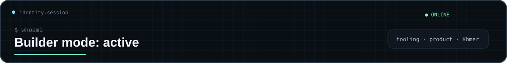
</p>

I'm a Flutter developer focused on **developer tooling**, **local-first mobile products**, and **Khmer-first software**. I like building things with a clear technical idea, a considered interface, and enough depth to learn from in public.

<p align="center">
  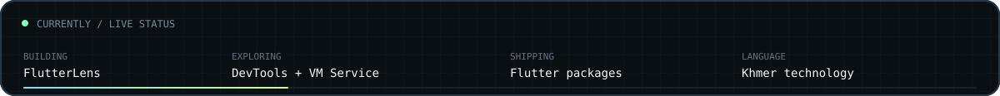
</p>

---

<p align="center">
  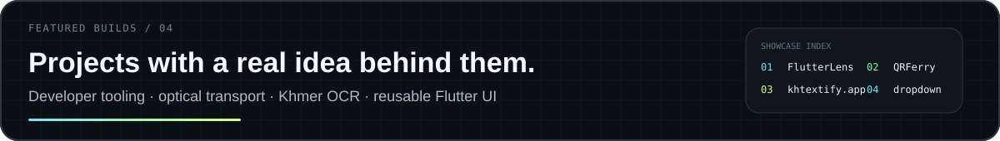
</p>

<a href="https://github.com/itskdey/flutterlens">
  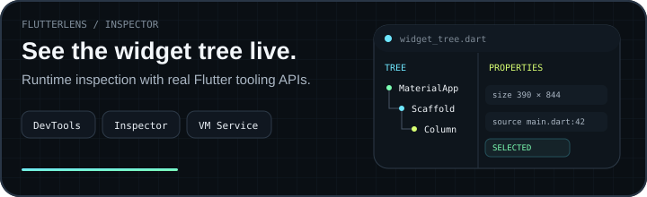
</a>

<br />

<a href="https://github.com/itskdey/qr_ferry_flutter">
  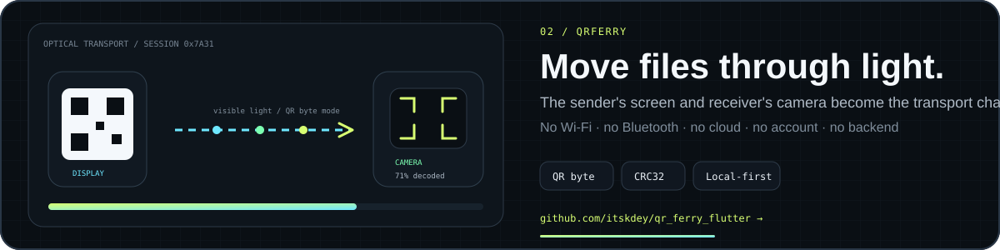
</a>

<br />

<a href="https://khtextify.app">
  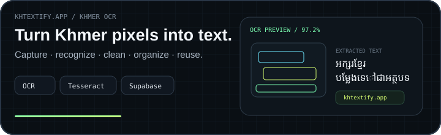
</a>

<br />

<a href="https://github.com/itskdey/full_width_dropdown_button">
  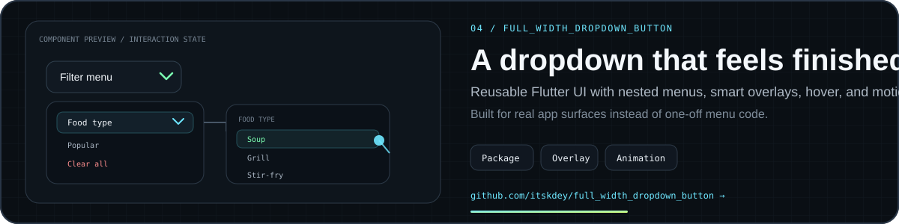
</a>

---

<p align="center">
  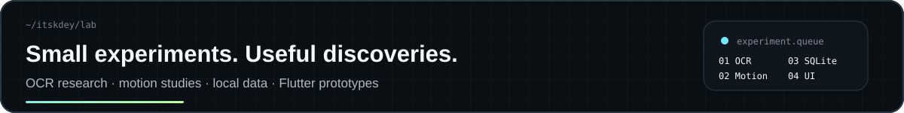
</p>

| Experiment | What I'm exploring |
| --- | --- |
| **[tesseract_khmer_training](https://github.com/itskdey/tesseract_khmer_training)** | Khmer OCR training, recognition quality, and Tesseract workflows |
| **[transition_animations](https://github.com/itskdey/transition_animations)** | Flutter motion, transitions, and interaction experiments |
| **[note_taking_app](https://github.com/itskdey/note_taking_app)** | Local note-taking UX, application structure, and mobile UI ideas |
| **[flutter-fetch-data-from-DB-file](https://github.com/itskdey/flutter-fetch-data-from-DB-file)** | Reading bundled SQLite data and local-data patterns in Flutter |

---

<p align="center">
  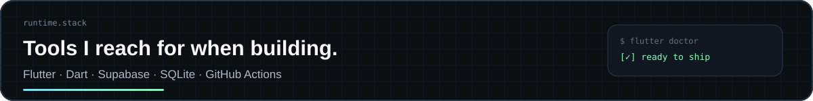
</p>

<p align="center">
  
  
  
  
  
  
</p>

```dart
const interests = <String>[
  'Flutter architecture',
  'developer experience',
  'product UI / UX',
  'local-first software',
  'Khmer language technology',
  'OCR',
  'open source',
];
```

---

<p align="center">
  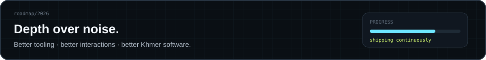
</p>

- Turn **FlutterLens** into a serious open-source inspection tool.
- Go deeper into **DevTools extensions, VM Service APIs, and Flutter Inspector internals**.
- Build interfaces with stronger **motion, interaction, and visual identity**.
- Ship better tools for **Khmer-language users** and reusable Flutter packages.

---

<p align="center">
  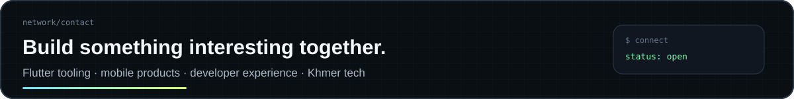
</p>

<div align="center">

### `build interesting things → make them useful → open-source the good parts`

Working on Flutter tooling, mobile products, developer experience, or Khmer technology?

**[Email me](mailto:meanpheakdey069@gmail.com) · [LinkedIn](https://www.linkedin.com/in/mean-pheakdey-6849a4287/) · [X](https://twitter.com/itskdey)**

<sub>Phnom Penh, Cambodia · @itskdey</sub>

</div>
