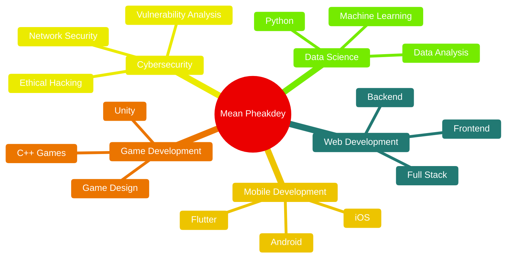

<!-- Profile Header -->
<h1 align="center">
  
</h1>

<!-- <p align="center">
  <samp>
    💻 Software Developer | 🎮 Game Enthusiast | 🚀 Technology Explorer
  </samp>
</p> -->

<!-- Social Links -->
<p align="center">
  <a href="mailto:meanpheakdey069@gmail.com">
    
  </a>

  <a href="https://twitter.com/itskdey">
    
  </a>

  <a href="https://www.linkedin.com/in/mean-pheakdey-6849a4287/">
    
  </a>

  <a href="https://www.instagram.com/itskdey/">
    
  </a>

  <a href="https://www.facebook.com/itskdey/">
    
  </a>

  <a href="https://www.youtube.com/channel/UCcLED5up-1-RgYkOYdc_ZUw">
    
  </a>
</p>


<p align="center">
  
</p>

---

## 👨‍💻 About Me

```javascript
const meanPheakdey = {
    name: "Mean Pheakdey",
    location: "Phnom Penh, Cambodia",
    education: "Computer Science Student, Cybersecurity Student",
    currentFocus: ["Mobile Development", "Web Development", "Game Development"],
    workingOn: ["KhTextify"],
    learning: ["Flutter", "Cloud Architecture", "Advanced Flutter Animations", "AR in Flutter", "System Design"],
    hobbies: ["Gaming", "Open Source", "Problem Solving", "Motorcycles", "Tech Exploration", "Building Cool Apps"],
    askMeAbout: ["Web Dev", "Mobile Dev", "C++", "Python", "Game Design"],
    role: "Programmer & Flutter Developer",
    focus: ["Mobile Development", "UI/UX", "Backend APIs"],
    mainStack: ["Flutter", "Dart", "GetX", "Supabase", "Cloudinary"],
    funFact: "Software developer by day, code ninja by night! 🥷"
};
```

---

## 🚀 Current Projects

### 📱 Active Development

<table>
  <tr>
    <td width="50%">
      <h3 align="center">KhTextify</h3>
      <p align="center">
        <a href="https://khtextify.app">
          
        </a>
      </p>
      <p align="center">
        A Khmer OCR scanning and text utility mobile app — scan, extract, and organize Khmer-language text, with a diary module, note editor, and AI chat panel for working with scanned content.
      </p>
      <p align="center">
        
        
        
        
        
      </p>
    </td>
    <td width="50%">
      <h3 align="center">KhTextify Web</h3>
      <p align="center">
        <a href="https://khtextify.app">
          
        </a>
      </p>
      <p align="center">
        The companion web presence for KhTextify — landing page and product info for the Khmer OCR app, built to match the app's premium visual style.
      </p>
      <p align="center">
        
        
        
      </p>
    </td>
  </tr>
</table>

---

## 💼 Professional Experience

### Contributed Projects

<details>
<summary><b>🤝 Open Source Contributions</b></summary>
<br>

> *Add your contributed projects here*

- **Project Name** - Brief description of your contribution
  - Technologies: `Technology Stack`
  - Role: Your specific contributions
  - [Repository Link](#)

</details>

### Academic Projects

<details>
<summary><b>🎓 University & School Projects</b></summary>
<br>

#### C++ Movie Management System
- Comprehensive movie database management system built with C++
- Features: CRUD operations, search functionality, user authentication
- **Tech Stack:** C++, File I/O, OOP principles

#### Personal Portfolio Website
- Professional portfolio showcasing projects and skills
- **Live Demo:** [meanpheakdey.epizy.com](http://www.meanpheakdey.epizy.com/)
- **Tech Stack:** HTML, CSS, JavaScript, PHP

</details>

### Personal Projects

<details>
<summary><b>🛠️ Side Projects & Experiments</b></summary>
<br>

#### Heartbleed Security Analysis
- Research project analyzing the Heartbleed vulnerability
- Status: 🔄 In Progress
- **Focus:** Cybersecurity, Cryptography, Network Security

#### Additional Projects
- Add your personal projects here
- Include brief descriptions and technologies used

</details>

---

## 🛠️ Technical Skills

### Languages

<p>
  
  
  
  
  
  
  
  
</p>

### Frameworks & Libraries

<p>
  
  
  
  
  
  
  
</p>

### Tools & Technologies

<p>
  
  
  
  
  
  
</p>

### Databases

<p>
  
  
  
  
</p>

---

<details> 
  <summary><h2>📊 Github Stats and Activity</h2></summary>

  <h3>🔥 Streak Stats</h3>

  <!-- GitHub Readme Streak Stats - https://github.com/DenverCoder1/github-readme-streak-stats -->
  <p>
    <a href="#">
      
    </a>
  </p>

  <h3>💻 GitHub Profile Stats</h3>

  <!-- https://github.com/anuraghazra/github-readme-stats -->

  <a href="https://github.com/anuraghazra/github-readme-stats"></a>
  <a href="https://github.com/anuraghazra/github-readme-stats"></a>
  <br/>

  <b>Note:</b> Top languages is only a metric of the languages my public code consists of and doesn't reflect experience or skill level.
  
  <!-- https://github.com/ashutosh00710/github-readme-activity-graph -->

  <a href="https://github.com/ashutosh00710/github-readme-activity-graph"></a>

</details>

---

## 🎯 Areas of Interest


```mermaid
%%{init: {'theme':'base', 'themeVariables': { 'primaryColor':'#ff6b6b', 'primaryTextColor':'#fff', 'primaryBorderColor':'#ee5a6f', 'lineColor':'#4ecdc4', 'secondaryColor':'#4ecdc4', 'tertiaryColor':'#ffe66d', 'background':'#1a1a2e', 'mainBkg':'#ff6b6b', 'secondBkg':'#4ecdc4', 'tertiaryBkg':'#95e1d3', 'textColor':'#f8f9fa'}}}%%
mindmap
  root((Mean Pheakdey))
    Web Development
      Frontend
      Backend
      Full Stack
    Mobile Development
      Flutter
      Android
      iOS
    Game Development
      Unity
      Game Design
      C++ Games
    Cybersecurity
      Network Security
      Vulnerability Analysis
      Ethical Hacking
    Data Science
      Machine Learning
      Data Analysis
      Python
```

---

## 🏆 Achievements & Certifications

<details>
<summary><b>📜 View Certifications & Achievements</b></summary>
<br>

> *Add your certifications and achievements here*

- **Cybersecurity Professional Certificate** - American University of Phnom Penh - AUPP (2023)
- **Achievement Title** - 

</details>

---

## 📝 Latest Blog Posts

<!-- BLOG-POST-LIST:START -->
> *Coming Soon! Will be sharing technical articles and tutorials.*
<!-- BLOG-POST-LIST:END -->

---

## 🤝 Let's Connect!

<p align="center">
  <i>I'm always interested in collaborating on interesting projects, discussing technology, or just having a chat!</i>
</p>

<p align="center">
  <a href="mailto:meanpheakdey069@gmail.com">
    
  </a>
  <a href="https://meanpheakdey.epizy.com">
    
  </a>
</p>

---

<p align="center">
  
</p>

<p align="center">
  <i>⭐️ From <a href="https://github.com/itskdey">itskdey</a> - Feel free to star my repositories if you find them interesting!</i>
</p>
